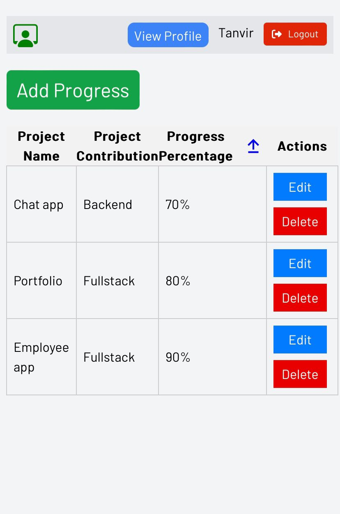

Live Site : https://employee-evaluation.netlify.app/

👥 User Roles: Admins, employees, and evaluators can register and access the app.

📊 Work Updates: Employees can conveniently update their progress using forms.

📈 Performance Insights: Admins can analyze the data and provide valuable recommendations for promotions, increments, or both, based on the employees' exceptional contributions.

💼 Elevate The Team: Evaluators can easily identify recommended individuals and take the necessary steps.

Tech Stack:
Backend: Node.js with Express.js
Database: MongoDB
Frontend: React with JavaScript
UI: Tailwind CSS
Deployment: render , netlify.

